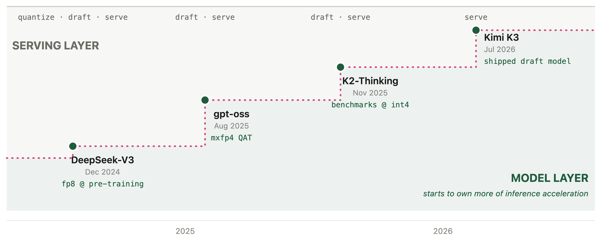

# 3. What's Next

<!-- 定位：acceleration 移进 training（ownership）；speculation 往 harness 层扩散（Alex Zhang sPTC 引用位，https://alexzhang13.github.io/blog/2026/spec-ptc/）；quality-aware draft training 不存在。 -->

## 定稿

Section 2 brought awareness of lossy inference. In this section we go through the exciting new directions for speculative decoding: (3.1) multimodal speculative decoding, (3.2) speculative decoding going from tokens to tool calls, and (3.3) inference acceleration ownership.

### 3.1 Multimodal Speculative Decoding

Everything so far is language model-based speculative decoding, but a growing share of decoding needs is not only text. Vision-language models are how a model sees: a computer-use agent reads a screenshot on every step of its loop, whether it is browsing the web or checking its own front-end code, and in chat the same models parse the documents, charts, and videos that users drop in.

So the question is: can we expect speculative decoding to work for multimodal language models as well?

The answer is not yet: no multimodal speculative decoding method has reached mainstream adoption. vLLM merged its first VLM support for EAGLE-3 (Qwen2.5-VL only) in v0.11.1 ([vLLM #22872](https://github.com/vllm-project/vllm/pull/22872)) while its other speculative paths still reject multimodal models, and SpecForge, SGLang's draft-training framework, lists VLM integration as roadmap ([SpecForge, 2025](https://www.lmsys.org/blog/2025-07-25-spec-forge/)). The research side explains why the transfer is hard. MMSpec, the first VLM speculative decoding benchmark, measures over 600 samples across ten algorithms ([MMSpec, 2026](https://arxiv.org/abs/2603.14989)), and its main finding is that speculative decoding designed for language models can degrade on multimodal input. The documented reason is that the drafter's vision falls short of the target's. The standard drafters are small language models with no components for visual input, so their predictions fail to match a target that conditions on the image ([MASSV, 2025](https://arxiv.org/abs/2505.10526)). Using a small VLM does not close the gap either: ViSpec's hypothesis is that a large VLM filters redundant image information layer by layer, while a small model struggles to do the same, so vision capability degrades disproportionately as the drafter shrinks ([ViSpec, NeurIPS 2025](https://neurips.cc/virtual/2025/poster/115277)). Either way, the draft diverges from the vision-conditioned target and acceptance drops.

The early fixes share one idea: let the drafter reuse the target's visual understanding instead of re-earning it. MASSV connects the target's own vision encoder to the draft model through a lightweight projector and distills on the target's responses, reaching up to 30% longer accepted length and 1.46x end-to-end speedup over text-only drafting ([MASSV, 2025](https://arxiv.org/abs/2505.10526)). ViSpec trains a vision-aware drafter and reports the first substantial speedups on VLM decoding ([ViSpec, NeurIPS 2025](https://neurips.cc/virtual/2025/poster/115277)).

### 3.2 From Speculating Tokens to Speculating Tool Calls

Everything so far talks about speculating tokens. What about going one level higher, to speculating tool calls for agents? In an agent, the expensive unit is the tool call: a sub-LLM query or an API request takes seconds while the code that invokes it is still being written.

One early answer is speculative programmatic tool calling ([Zhang, 2026](https://alexzhang13.github.io/blog/2026/spec-ptc/)). While the model is still writing its code, a second interpreter runs the partial code in the background, and any tool call whose inputs are already fully determined is launched ahead of time. When the finished code runs for real, each pre-launched call is compared against the call the code actually makes: a match returns the stored result immediately, a mismatch is discarded and the call runs again. A wrong guess costs only the wasted early launch. On the OOLONG benchmark with Qwen3-30B, this overlap recovers 1 to 1.2x end to end.

There is an emerging research direction around this idea: Speculative Interaction Agents formally define speculative tool calling to cut time-to-first-token ([Hooper et al., 2026](https://arxiv.org/abs/2605.13360)), and Act While Thinking pre-executes tool calls predicted from patterns in the reasoning trace ([Ji et al., 2026](https://arxiv.org/abs/2603.18897)). What the line does not have yet is a shared benchmark: each paper evaluates on its own setup, borrowing OOLONG ([2025](https://arxiv.org/abs/2511.02817)) or building a private task corpus; a standard evaluation for speculative tool calling does not exist yet.

Section 1's three factors carry over unchanged: pre-launching is the drafting, the comparison against the real call is the verification, and the fraction of pre-launched calls that get used is the acceptance rate of the agent world.

### 3.3 Should the Model Layer Own Inference Acceleration?

Step by step, acceleration is moving from the serving layer into frontier labs. DeepSeek pushed FP8 into pre-training with DeepSeek-V3 ([DeepSeek-AI, 2024](https://arxiv.org/abs/2412.19437)). OpenAI shipped gpt-oss MXFP4 weights with quantization-aware training ([OpenAI, 2025](https://arxiv.org/abs/2508.10925)). K2-Thinking reported every benchmark number at INT4, making the quantized model the official model. Kimi K3 has the draft model fine-tuned as part of post-training, and validated before the model leaves the lab ([Kimi Team, 2026](https://arxiv.org/abs/2607.24653)).

Each step, from 2025 to 2026, shows frontier labs owning more of the inference acceleration space. The work used to be owned by the serving layer. An inference provider would take the released FP8 weights, quantize them, train a draft model on top, and serve it on OpenRouter for the general public. This meant the inference layer owned the quality evaluation. But now, the labs do this work themselves and validate it before the model ships, leaving less room for the inference layer ([LosslessBench](https://lilyzh.ng/writing/losslessbench/), Figure 6).

Figure 13. The model layer absorbs acceleration step by step. The room left for serving shrinks toward one job: serve. From [LosslessBench](https://lilyzh.ng/writing/losslessbench/) Figure 6, boundary redrawn as steps.

This ownership shift fixes the missing quality validation: the lab validates the accelerated model before it ships, closing the gap Section 2 described.

<!-- 弃用备份(9/2,Lily:提出的问题必须有解答,不写 unanswered limitation):quality-aware draft training 段(DistillSpec/EAGLE/LK losses/Judge Decoding 引用),原文见 git 历史 -->

## 旧版素材（原 What's Next 全文，改写来源）

> 

> 
> ## 3 · What's Next?
> 
> 

> 
> 

> 
> ### 3.1 · Acceleration is moving into training
> 
> The industry is already answering part of the question, not by fixing the eval but by moving the acceleration to where it can be validated before release. DeepSeek pushed FP8 into pre-training with DeepSeek-V3 ([DeepSeek-AI, 2024](https://arxiv.org/abs/2412.19437)). gpt-oss shipped MXFP4 weights with quantization-aware training ([OpenAI, 2025](https://arxiv.org/abs/2508.10925)). K2-Thinking reported every benchmark number at INT4, making the quantized model the official model. Kimi K3 ships the speculator itself: the draft model is fine-tuned as part of post-training, against the deployment-precision target, and validated before the model leaves the factory ([Kimi Team, 2026](https://arxiv.org/abs/2607.24653)).
> 
> 
TBDFigure: timeline of acceleration moving from the
>       serving layer into training, adapted from LosslessBench Figure 6.

> 
> This is why the ownership split in Section 3.2 produced a 0.3-point loss on one side and a 5.6-point loss on the other. When the model owner trains and validates the acceleration, the accelerated model is the released model, and there is nothing left for a serving vendor to bolt on unverified. When acceleration is assembled downstream by whoever hosts the model, the lossless claim belongs to no one, and no one checks it. Whoever owns the acceleration owns the quality.
> 
> 

> 
> 

> 
> ### 3.2 · The training objective nobody has built
> 
> This ownership shift fixes the missing quality validation: the lab validates the accelerated model before it ships, closing the gap Section 2 described. One thing remains open: the draft's training objective. Every published draft-training objective optimizes alignment with the target or acceptance itself: distillation on target outputs in DistillSpec ([Zhou et al., 2024](https://arxiv.org/abs/2310.08461)), feature regression in EAGLE-3 ([Li et al., 2025](https://arxiv.org/abs/2503.01840)), and the LK loss that directly maximizes per-token acceptance ([Samarin et al., 2026](https://arxiv.org/abs/2602.23881)). No published objective trains a draft to preserve the target's behavior on the long tail, the high-entropy domains where Section 3.4 showed acceptance is weakest and verification is thinnest. The closest published work operates at the verification layer instead: Judge Decoding ([Bachmann et al., 2025](https://arxiv.org/abs/2501.19309)) trains the verifier to accept tokens that differ from the target but preserve quality. Quality-aware draft training does not exist yet.
> 
> 

> 
> 

> 
> ### 3.3 · Proposal
> 
> The evaluation fix is smaller than the training fix, and available today: report behavior alongside speed. A speculative-decoding eval should publish three numbers together, acceptance rate, task correctness on the same generations, and the domain coverage of the prompt set. The first is what the field already reports. The second costs one grading pass over outputs the harness already produces. The third is a list of names. Section 5 shows that a single afternoon and one GPU are enough to produce all three.
> 
> > **Open questions.** What does a draft-training objective that weights long-tail behavior look like, and does it cost acceptance rate? When acceleration ships inside the model, who audits the model owner's own lossless claim? And acceptance rate is domain-conditional; is there a principled way to choose the domain mix of a speculative-decoding eval, rather than inheriting whatever benchmarks are nearby?
> 
> 

