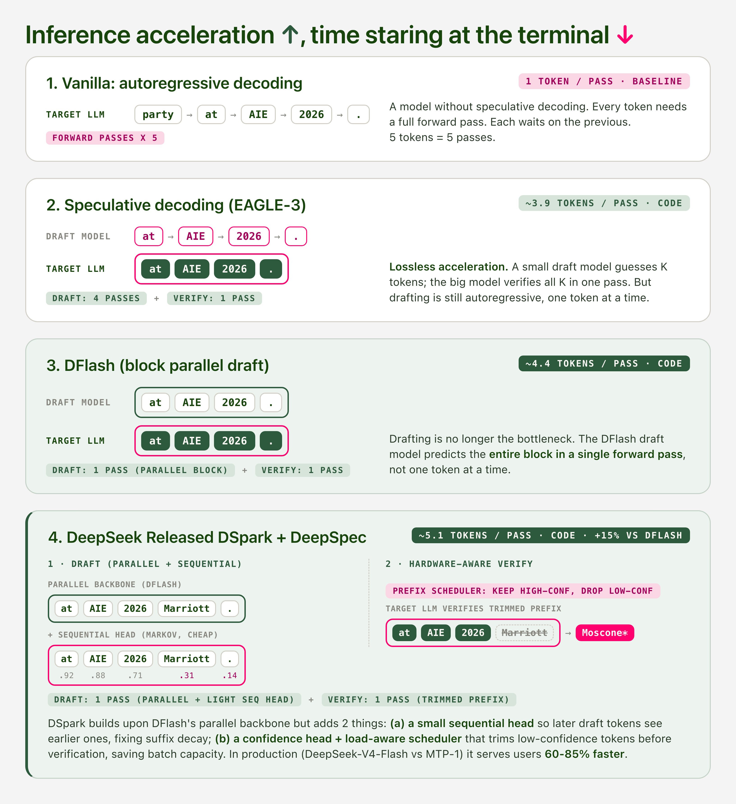

## 1 · Introduction

The market wants more tokens. Agent workflows chain dozens of model calls per task, reasoning models spend thousands of tokens thinking before they answer, and every product built on either one pays for latency twice, once in compute and once in user patience. The ideal answer to this demand is lossless inference acceleration: serve the same model faster without changing what it outputs.

That demand has pulled acceleration steadily deeper into the model itself. Draft models for speculative decoding evolved through three generations in two years, from EAGLE-3's feature-level autoregressive drafting ([Li et al., 2025](https://arxiv.org/abs/2503.01840)), to DFlash's block-parallel diffusion drafting ([Chen et al., 2026](https://arxiv.org/abs/2602.06036)), to DSpark's confidence-scheduled verification ([DeepSeek, 2026](https://arxiv.org/abs/2607.05147)). Frontier labs moved in the same direction from the training side: DeepSeek pushed FP8 into pre-training, gpt-oss shipped MXFP4 weights with quantization-aware training, K2-Thinking reported every benchmark at INT4, and Kimi K3 ships the speculator itself, a draft model fine-tuned and validated before release ([Kimi Team, 2026](https://arxiv.org/abs/2607.24653)).

<figure>

<figcaption><strong>Figure 1.</strong> The same sentence decoded four ways. Vanilla needs one forward pass per token. EAGLE-3 drafts K tokens sequentially and verifies them in one pass. DFlash drafts the whole block in one pass. DSpark trims low-confidence draft tokens before verification.</figcaption>
</figure>

Inference providers now run some combination of quantization, speculative decoding, and serving-level optimizations on nearly every hosted model, and the field reports progress in tokens per second while describing the acceleration as lossless. What no one owns is the quality of the accelerated output. Outside of coding and math, almost no one has checked whether the accelerated model still behaves like the original. The evaluation surface behind the word "lossless" is narrow, and the claim is rarely tested directly.

